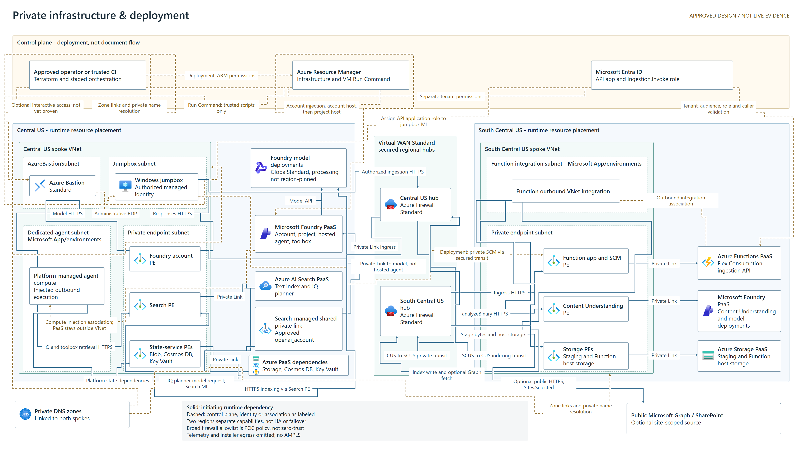
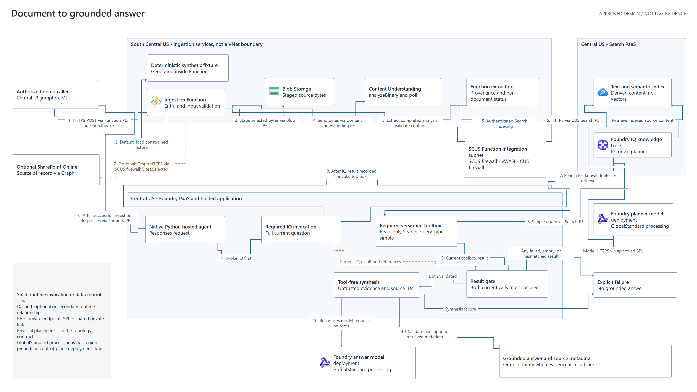

# funwithfoundry

A secure multi-region Microsoft Foundry reference POC for Azure engineers learning
private ingestion, network-injected hosted agents and grounded retrieval.
It is not a production-ready, active-active or zero-trust platform.

The complete demo sends a constrained document through the **South Central US
ingestion Function**, private Blob Storage and Content Understanding, then indexes
it in **Central US AI Search** across two secured vWAN hubs. A native Python hosted
agent must complete both Foundry IQ and versioned Search-toolbox retrieval before
producing a grounded answer with source metadata.

## Current status

The fresh rebuild and core live acceptance **passed**. See [status.md](status.md)
and the [validation report](docs/VALIDATION.md) for evidence and explicit limitations.
Local release gates passed; GitHub-hosted checks and publication remain separate.

The user-approved teardown of the existing lab is complete: both old Foundry
accounts were verified purged, the network/CUS/SCUS resource groups were absent,
and Terraform state was empty. Two remaining lab-tagged, unattached NSGs were
removed from the exact approved group. The repository and unrelated resources
remain outside the teardown scope.

Fresh preflight returned **51 PASS, 0 WARN, 0 FAIL**. Infrastructure is deployed,
both capability hosts are ready, and the post-recovery Terraform plan reported
no changes. Function ingestion, Search provenance, IQ, native dual retrieval and
the three golden questions passed. Agent and toolbox reruns retained version 1.
This is the approved rebuild of the existing lab, not an isolated duplicate;
the new-VM tools and scoped runtime roles are verified. The validation report
documents required recovery steps instead of claiming unattended deployment.

The earlier v5 hosted-agent smoke and infrastructure checks are **historical**.
They do not validate the new runtime or Entra-authorized Function demo.
Real SharePoint and interactive Bastion RDP remain unverified here. See the
[evidence table](docs/architecture.md#evidence-status).

## Quickstart

1. Review [deployment prerequisites and the short path](docs/deployment.md), including
   separate ARM/PIM and Entra app-registration/app-role permissions.
2. Use uv with isolated component environments and the actual runtime/dependency
   settings in [compatibility.md](docs/compatibility.md).
3. Run [local checks](docs/automation.md#local-checks) before any cloud work.
4. Review the two approved Mermaid contracts and reproduced 3840 x 2160 PNGs below.
   Both images were inventoried and visually inspected; the approved Mermaid hashes
   are unchanged. Diagram approval is complete, not a pending gate.
5. Follow the approved rebuild's remaining gates, ordered workflow and
   [complete Function demo](docs/deployment.md#complete-demo). SharePoint is optional
   and requires a separate site-scoped consent and real invocation.

The staged entrypoint is [scripts/Invoke-Accelerator.ps1](scripts/Invoke-Accelerator.ps1).
Use the commands in [deployment.md](docs/deployment.md). The verified offline bundle
contains four artifacts totaling **133,431,295 bytes**: azd `1.33.0` MSI, uv `0.8.13`
ZIP, the official Python `3.13.7` PSF-signed installer and a ZIP of eight pinned
extensions. Live SFTP transfer through Bastion verified all four hashes on the old
VM. Cleanup required an explicitly user-approved restart for a loaded profile;
durable managed Run Command read-back confirmed `cleaned=true`. This does not prove
installation or unattended bootstrap on the new VM.

## Architecture contracts

- [Secure multi-region topology][topology]
   separates control-plane operations, PaaS services, private endpoints and
   injected compute.
- [Document-to-grounded-answer flow][runtime]
   shows authorized Function ingestion, actual SCUS-to-CUS indexing and
   deterministic retrieval.

[topology]: docs/diagrams/capability-host-deployment-azure-architecture.mmd
[runtime]: docs/diagrams/runtime-flow-azure-architecture.mmd

The existing topology filename is retained for continuity, but its viewpoint is
no longer just capability-host deployment.
See [architecture.md](docs/architecture.md)
for decisions, identity scopes, DNS, routing, data ownership and review notes.

## Privacy and scope

SharePoint/Graph is **public HTTPS egress**, even when the Function is private.
Private endpoints secure configured data-plane access; they do not make all
platform, identity, package-feed or telemetry traffic private. Foundry PaaS remains
outside the VNet; its private endpoints are in the PE subnet and its agent compute
is associated with the dedicated injection subnet.

`GlobalStandard` model deployments do **not** pin processing to Central US or South
Central US. The broad firewall allowlist is a POC tradeoff, not an exfiltration-proof
policy. The index is text/semantic with no vector fields; the toolbox deliberately
uses `query_type: simple`. No regional replication/failover, production SLO,
customer-managed keys or Azure Monitor Private Link Scope is promised.

## Cost and operations

Two Azure Firewalls, two vWAN hubs, Bastion, Search and Cosmos have ongoing charges.
**Deallocating the VM does not stop firewall, hub, Bastion or Search billing.**
Use a dated estimate and budget alerts.
[operations.md](docs/operations.md) covers cost
modes, troubleshooting, rollback and exact-ID teardown ordering: project capability
host, accounts, verified purge, then network. Do not purge by a broad prefix.

Terraform state/plans and azd state can contain credentials and identifiers.
Protect them outside version control; ignore rules alone are not protection. See
[SECURITY.md](SECURITY.md) and the optional Entra-authenticated remote-backend guidance
in [deployment.md](docs/deployment.md#state-and-configuration).

## Maintenance and support

This POC supports the default branch; it has no support SLA or certified broad version
matrix. [compatibility.md](docs/compatibility.md) distinguishes pins, ranges, historical
observations and untested combinations. [automation.md](docs/automation.md) explains
advisory hooks, required PR checks, OIDC/private-runner trust and approval gates.
Dependency updates require review and must never automatically deploy infrastructure.

Report reproducible issues without private environment data. Report vulnerabilities
privately using [SECURITY.md](SECURITY.md). The approved publication scope is recorded
in [docs/ACCELERATOR-PLAN.md](docs/ACCELERATOR-PLAN.md).

## License

Licensed under the [MIT License](LICENSE).
