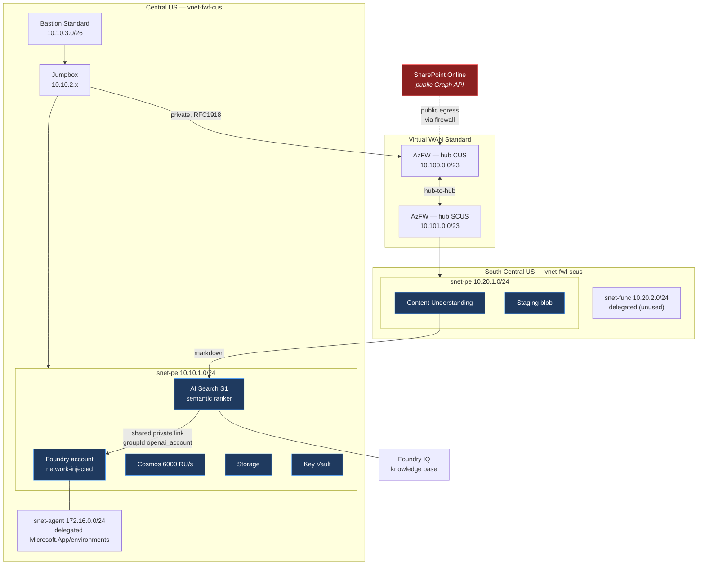

# Architecture

## Verified data path

**Red is the only public hop.** The SharePoint fetch leaves Azure over the internet. Everything
downstream stays on private endpoints.

## The two non-obvious things

**Azure Firewall breaks private endpoints by default.** Routing intent sends cross-spoke traffic to
the firewall. Network rules are evaluated before application rules — with no matching network rule,
an HTTPS call to a private endpoint falls through to an application rule, which proxies it and
re-originates from the firewall's *public* IP. The service then answers
`403 "Public access is disabled"`. A `private-to-private` network rule fixes it. Same-region calls
mask the problem entirely, because intra-VNet traffic never reaches the firewall.

**AI Search needs a shared private link for outbound.** Search has no VNet integration for egress.
Its Foundry IQ query planner calls the Foundry chat model as the *search service* identity, so it
needs both `Cognitive Services OpenAI User` on the Foundry account and an approved shared private
link with `groupId = openai_account` — not `account`, despite that being the only group the Foundry
account advertises.

## What is proven vs. assumed

| Claim | Status |
|---|---|
| All private endpoint FQDNs resolve privately in-VNet | Verified — 9/9 |
| Cross-region CUS → SCUS on 443 via both hub firewalls | Verified |
| Public workstation refused on data plane | Verified — 403 on all three |
| Content Understanding available in South Central US | Verified — analyzer list + `analyzeBinary` |
| Document → CU → Search → Foundry IQ → grounded answer | Verified — answer with citation |
| Capability hosts provisioned | Verified — both `Succeeded` |
| SharePoint → blob leg | **Not exercised** — needs Graph `Sites.Selected` consent |
| Flex Consumption Function | **Not deployed** — pipeline proven from the jumpbox instead |
| Bastion RDP under routing intent | **Not tested** — validation used `az vm run-command` |
