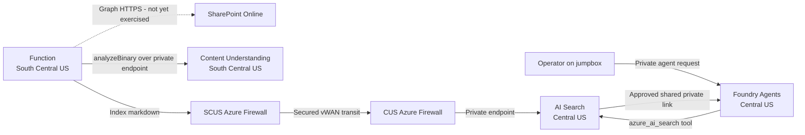
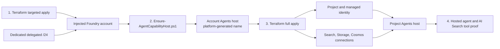

# Architecture

This lab separates capabilities by region rather than providing regional failover. Central US hosts
the network-injected Agents platform, AI Search, agent state, and model deployments. South Central
US hosts Content Understanding and the ingestion Function. Secured Virtual WAN provides controlled
cross-region transit.

The authoritative Mermaid contracts are the
[runtime flow](diagrams/runtime-flow-azure-architecture.mmd) and
[capability-host deployment flow](diagrams/capability-host-deployment-azure-architecture.mmd).

## Verified data path

The SharePoint edge is dashed because it is the intended public ingress leg but remains untested.
The verified synthetic proof begins with a generated document on the jumpbox, then exercises
Content Understanding, cross-region indexing, Foundry IQ retrieval, and the hosted agent.

## Capability-host deployment flow

The account host is intentionally managed by the idempotent helper because Azure stores the
singleton under a platform-generated name. Terraform owns the project host and its dependencies.

## The two non-obvious things

**Azure Firewall breaks private endpoints by default.** Routing intent sends cross-spoke traffic to
the firewall. Network rules are evaluated before application rules — with no matching network rule,
an HTTPS call to a private endpoint falls through to an application rule, which proxies it and
re-originates from the firewall's *public* IP. The service then answers
`403 "Public access is disabled"`. A `private-to-private` network rule fixes it. Same-region calls
mask the problem entirely, because intra-VNet traffic never reaches the firewall.

**AI Search needs a shared private link for outbound.** Search has no VNet integration for egress.
Its Foundry IQ query planner calls the Foundry chat model as the *search service* identity, so it
needs both `Cognitive Services OpenAI User` on the Foundry account and an approved shared private
link with `groupId = openai_account` — not `account`, despite that being the only group the Foundry
account advertises.

**Data-service authentication is keyless.** Foundry, AI Search, Storage, and Cosmos DB disable local
or shared-key authentication. Terraform uses Entra ID for storage data-plane operations, and the
Function, jumpbox, Search planner, project, and hosted agent use managed identities plus scoped
Azure RBAC. The jumpbox still has a generated local administrator password for Bastion RDP.

## What is proven vs. assumed

| Claim | Status |
|---|---|
| Control-plane deployment | Verified 2026-09-08 - 24 PASS, 0 WARN, 0 FAIL |
| Terraform convergence | Verified 2026-09-08 - zero drift after keyless Search hardening |
| All private endpoint FQDNs resolve privately in-VNet | Verified - 9/9 |
| Cross-region private HTTPS through both hub firewalls | Verified |
| Public workstation refused on data plane | Verified - HTTP 403 |
| Content Understanding in South Central US | Verified - analyzer list and `analyzeBinary` |
| Generated document to CU to Search to Foundry IQ | Verified - grounded answer with citation |
| Account and project Agents capability hosts | Verified - both `Succeeded` |
| Hosted `gpt-4o` agent with `azure_ai_search` | Verified - run completed with grounded citation |
| AI Search local/API-key authentication | Disabled and regression-tested with Entra ID flows |
| Flex Consumption Function deployment | Verified - package active and `ingest` trigger synchronized |
| SharePoint Graph fetch through the Function | **Not exercised** - needs Graph `Sites.Selected` consent |
| Bastion RDP under routing intent | **Not tested** - validation used `az vm run-command` |

## Deliberate limitations

- This is capability placement across two regions, not active-active or disaster recovery.
- AI Search uses one replica and Cosmos DB uses one non-zone-redundant region.
- Customer-managed keys, AMPLS, centralized diagnostics, CI/CD, and a production SLO are excluded.
- `gpt-5.2` is the Foundry IQ planner; tool-calling hosted agents use `gpt-4o` because the tested
    `gpt-5.2` plus `azure_ai_search` combination fails with an opaque service error.
